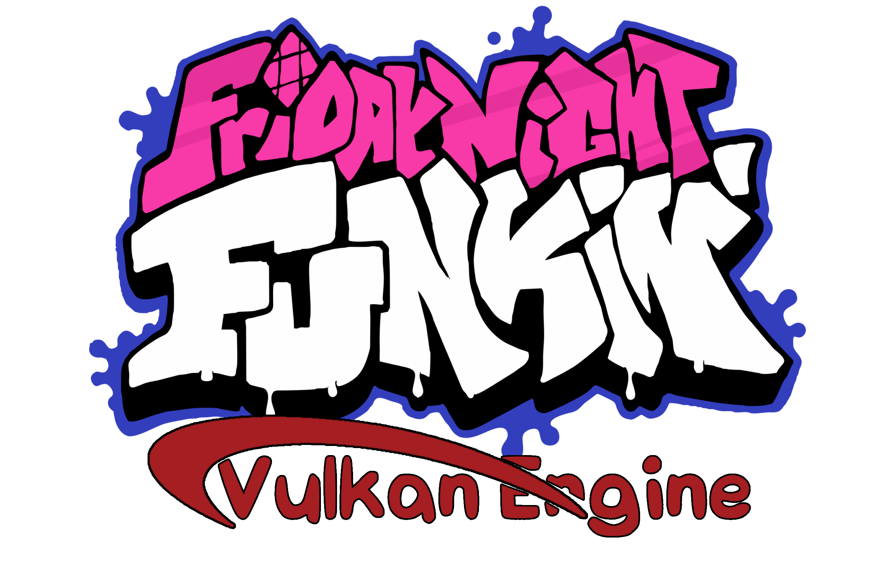

<!-- PROJECT LOGO -->
 

  

  <h3 align="center">FNF Vulkan Engine</h3>

  

    A Friday Night Funkin Engine Made On C And Vulkan API!
  

## This is currently a W.I.P

<!-- FNF VULKAN ENGINE CREDITS -->
# FNF Vulkan Engine Credits
## Programming
- Sector - Frontend Programming
- Sirox - Backend and Frontend Programming

## Libraries
- [SDL](https://github.com/libsdl-org/SDL) - Window Handling
- [Vulkan](https://github.com/KhronosGroup/Vulkan-Headers) - Main Graphics API
- [CGLM](https://github.com/recp/cglm) - GLM Implementation for C Programming Language
- [MiniAudio](https://github.com/mackron/miniaudio) - Audio Handling
- [Expat](https://github.com/libexpat/libexpat) - XML Parsing

## Special Thanks
- People from Reddit

<!-- ORIGINAL GAME CREDITS -->
# Friday Night Funkin' Credits
## Programming
- [ninjamuffin99](https://twitter.com/ninja_muffin99) - Lead Programmer
- [EliteMasterEric](https://twitter.com/EliteMasterEric) - Programmer
- [MtH](https://twitter.com/emmnyaa) - Charting and Additional Programming
- [GeoKureli](https://twitter.com/Geokureli/) - Additional Programming
- Contributors on GitHub

## Art / Animation / UI
- [PhantomArcade3K](https://twitter.com/phantomarcade3k) - Artist and Animator
- [Evilsk8r](https://twitter.com/evilsk8r) - Art
- [Moawling](https://twitter.com/moawko) - Week 6 Pixel Art
- [IvanAlmighty](https://twitter.com/IvanA1mighty) - Misc UI Design

## Music
- [Kawaisprite](https://twitter.com/kawaisprite) - Musician
- [BassetFilms](https://twitter.com/Bassetfilms) - Music for "Monster", Additional Character Design

## Special Thanks
- [Tom Fulp](https://twitter.com/tomfulp) - For being a great guy and for Newgrounds
- [JohnnyUtah](https://twitter.com/JohnnyUtahNG/) - Voice of Tankman
- [L0Litsmonica](https://twitter.com/L0Litsmonica) - Voice of Mommy Mearest

<!-- LICENSE -->
## License

Distributed under the GPL-2.0 License. See `LICENSE` for more information.
